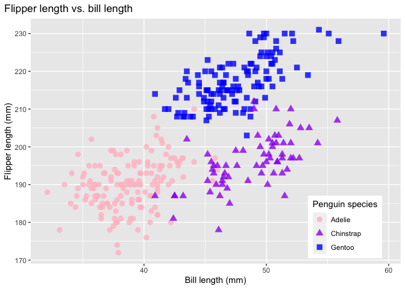

p8105_hw1_fm2751
================
2022-09-22

# Problem 0.1

Public GitHub repo, local R Project, and .Rmd file created and rendered
to github_document.

# Problem 0.2

See below.

# Problem 1

First, I install the package “palmerpenguins” in the console and load
library for later use.

``` r
library(tidyverse)
```

    ## ── Attaching packages ─────────────────────────────────────── tidyverse 1.3.2 ──
    ## ✔ ggplot2 3.3.6      ✔ purrr   0.3.4 
    ## ✔ tibble  3.1.8      ✔ dplyr   1.0.10
    ## ✔ tidyr   1.2.0      ✔ stringr 1.4.1 
    ## ✔ readr   2.1.2      ✔ forcats 0.5.2 
    ## ── Conflicts ────────────────────────────────────────── tidyverse_conflicts() ──
    ## ✖ dplyr::filter() masks stats::filter()
    ## ✖ dplyr::lag()    masks stats::lag()

Second, I load the dataset “penguins”.

``` r
data("penguins", package = "palmerpenguins")
```

## Description of the penguins dataset

In this section, you can have a summary about the “penguins” dataset.
Also, you can view the first 5 rows of the dataset to get a general
idea.

``` r
summary(penguins)
```

    ##       species          island    bill_length_mm  bill_depth_mm  
    ##  Adelie   :152   Biscoe   :168   Min.   :32.10   Min.   :13.10  
    ##  Chinstrap: 68   Dream    :124   1st Qu.:39.23   1st Qu.:15.60  
    ##  Gentoo   :124   Torgersen: 52   Median :44.45   Median :17.30  
    ##                                  Mean   :43.92   Mean   :17.15  
    ##                                  3rd Qu.:48.50   3rd Qu.:18.70  
    ##                                  Max.   :59.60   Max.   :21.50  
    ##                                  NA's   :2       NA's   :2      
    ##  flipper_length_mm  body_mass_g       sex           year     
    ##  Min.   :172.0     Min.   :2700   female:165   Min.   :2007  
    ##  1st Qu.:190.0     1st Qu.:3550   male  :168   1st Qu.:2007  
    ##  Median :197.0     Median :4050   NA's  : 11   Median :2008  
    ##  Mean   :200.9     Mean   :4202                Mean   :2008  
    ##  3rd Qu.:213.0     3rd Qu.:4750                3rd Qu.:2009  
    ##  Max.   :231.0     Max.   :6300                Max.   :2009  
    ##  NA's   :2         NA's   :2

``` r
head(penguins, 5)
```

    ## # A tibble: 5 × 8
    ##   species island    bill_length_mm bill_depth_mm flipper_l…¹ body_…² sex    year
    ##   <fct>   <fct>              <dbl>         <dbl>       <int>   <int> <fct> <int>
    ## 1 Adelie  Torgersen           39.1          18.7         181    3750 male   2007
    ## 2 Adelie  Torgersen           39.5          17.4         186    3800 fema…  2007
    ## 3 Adelie  Torgersen           40.3          18           195    3250 fema…  2007
    ## 4 Adelie  Torgersen           NA            NA            NA      NA <NA>   2007
    ## 5 Adelie  Torgersen           36.7          19.3         193    3450 fema…  2007
    ## # … with abbreviated variable names ¹​flipper_length_mm, ²​body_mass_g

``` r
nrow(penguins)
```

    ## [1] 344

``` r
ncol(penguins)
```

    ## [1] 8

The “penguins” dataset consists of 344 observations and 8 variables
(which are species, island, bill length in mm, bill depth in mm, flipper
length in mm, body mass in g, sex and year of birth). The “penguins”
dataset has 344 rows and 8 columns. This study collected data from 3
species of penguins (Adelie, Chinstrap, and Gentoo) found on 3 different
islands (Biscoe, Dream, and Torgersen). Among all variables, the
diversity in penguins’ body mass is the greatest, ranging from 2700g to
6300g. The number of female penguins (165) and male penguins (168) are
similar to each other. Penguins has a mean flipper length of 200.92mm.

## Plots

In this section, you will see a scatterplot illustrating the association
between penguins’ flipper length and bill length.

``` r
flipper_bill <- ggplot(data = penguins,
                         aes(x = bill_length_mm,
                             y = flipper_length_mm)) +
  geom_point(aes(color = species, 
                 shape = species),
             size = 3,
             alpha = 0.8) +
  scale_color_manual(values = c("pink","purple","blue")) +
  labs(title = "Flipper length vs. bill length",
       x = "Bill length (mm)",
       y = "Flipper length (mm)",
       color = "Penguin species",
       shape = "Penguin species") +
  theme(legend.position = c(0.85, 0.15),
        plot.title.position = "plot",
        plot.caption = element_text(hjust = 0, face= "italic"),
        plot.caption.position = "plot")
flipper_bill
```

    ## Warning: Removed 2 rows containing missing values (geom_point).

<!-- -->

``` r
ggsave("flipper_bill.pdf", height = 4, width = 6)
```

    ## Warning: Removed 2 rows containing missing values (geom_point).

-   NOTE: I have checked that flipper_bill.pdf has been successfully
    saved in my project directory.

# Problem 2

In this section, I will create a data frame comprised of \* a random
sample of size 10 from a standard Normal distribution; \* a logical
vector indicating whether elements of the sample are greater than 0; \*
a character vector of length 10; \* a factor vector of length 10, with 3
different factor “levels”.

``` r
df = tibble(
  sample = rnorm(10),
  vec_logic = sample > 0,
  vec_char = c("b", "e", "a", "u", "u", "t", "i", "f", "u", "l"),
  vec_factor = factor(c("Low", "Medium", "High", "Low", "High", "Medium", "High", "Low", "Medium", "High"))
)
df
```

    ## # A tibble: 10 × 4
    ##     sample vec_logic vec_char vec_factor
    ##      <dbl> <lgl>     <chr>    <fct>     
    ##  1 -0.102  FALSE     b        Low       
    ##  2 -0.0616 FALSE     e        Medium    
    ##  3 -1.66   FALSE     a        High      
    ##  4  0.980  TRUE      u        Low       
    ##  5 -1.29   FALSE     u        High      
    ##  6  0.441  TRUE      t        Medium    
    ##  7 -1.16   FALSE     i        High      
    ##  8  0.115  TRUE      f        Low       
    ##  9 -0.851  FALSE     u        Medium    
    ## 10  1.00   TRUE      l        High

``` r
mean(df$sample)
```

    ## [1] -0.2588115

``` r
mean(df$vec_logic)
```

    ## [1] 0.4

``` r
mean(df$vec_char)
```

    ## Warning in mean.default(df$vec_char): argument is not numeric or logical:
    ## returning NA

    ## [1] NA

``` r
mean(df$vec_factor)
```

    ## Warning in mean.default(df$vec_factor): argument is not numeric or logical:
    ## returning NA

    ## [1] NA

``` r
mean(as.numeric(df$sample))
mean(as.numeric(df$vec_logic))
mean(as.numeric(df$vec_char))
```

    ## Warning in mean(as.numeric(df$vec_char)): NAs introduced by coercion

``` r
mean(as.numeric(df$vec_factor))
```

Explanation:
